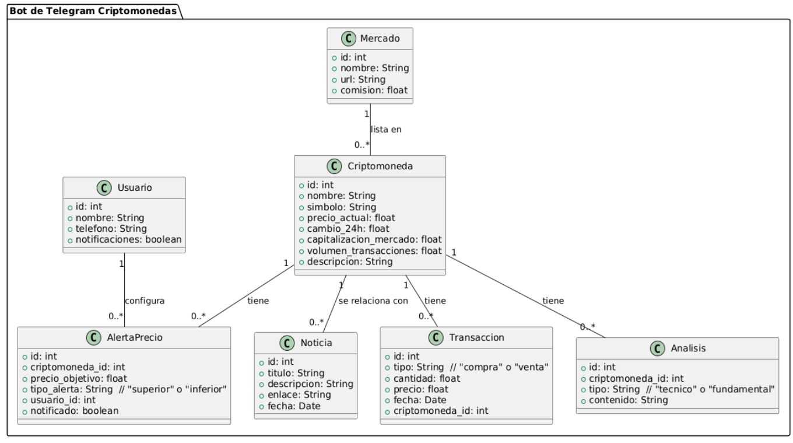

# Proyecto de Bot de Telegram para Criptomonedas


````
@startuml
package "Bot de Telegram Criptomonedas" {
    class Criptomoneda {
        +id: int
        +nombre: String
        +simbolo: String
        +precio_actual: float
        +cambio_24h: float
        +capitalizacion_mercado: float
        +volumen_transacciones: float
        +descripcion: String
    }

    class Mercado {
        +id: int
        +nombre: String
        +url: String
        +comision: float
    }

    class Transaccion {
        +id: int
        +tipo: String  // "compra" o "venta"
        +cantidad: float
        +precio: float
        +fecha: Date
        +criptomoneda_id: int
    }

    class Analisis {
        +id: int
        +criptomoneda_id: int
        +tipo: String  // "tecnico" o "fundamental"
        +contenido: String
    }

    class Noticia {
        +id: int
        +titulo: String
        +descripcion: String
        +enlace: String
        +fecha: Date
    }

    class AlertaPrecio {
        +id: int
        +criptomoneda_id: int
        +precio_objetivo: float
        +tipo_alerta: String  // "superior" o "inferior"
        +usuario_id: int
        +notificado: boolean
    }

    class Usuario {
        +id: int
        +nombre: String
        +telefono: String
        +notificaciones: boolean
    }

    Criptomoneda "1" -- "0..*" Transaccion : "tiene"
    Criptomoneda "1" -- "0..*" Analisis : "tiene"
    Criptomoneda "1" -- "0..*" Noticia : "se relaciona con"
    Criptomoneda "1" -- "0..*" AlertaPrecio : "tiene"
    Mercado "1" -- "0..*" Criptomoneda : "lista en"
    Usuario "1" -- "0..*" AlertaPrecio : "configura"
}
@enduml

````
## Objetivo

Desarrollar un bot de Telegram que permita a los usuarios consultar información sobre criptomonedas y recibir noticias actualizadas mediante scraping de varias fuentes confiables. El bot ofrecerá diversas funcionalidades relacionadas con Ethereum y otras criptomonedas.

## Fuentes de Noticias Recomendadas

1. **CoinDesk**
   - **URL**: [coindesk.com](https://www.coindesk.com)
   - **Descripción**: Principal fuente de noticias sobre criptomonedas, blockchain y finanzas digitales. Ofrece análisis en profundidad y artículos sobre las últimas tendencias en el sector.

2. **CoinTelegraph**
   - **URL**: [cointelegraph.com](https://www.cointelegraph.com)
   - **Descripción**: Proporciona noticias, análisis y artículos sobre el mundo de las criptomonedas y blockchain, con un enfoque visual que incluye gráficos y arte relacionado.

3. **CryptoSlate**
   - **URL**: [cryptoslate.com](https://www.cryptoslate.com)
   - **Descripción**: Ofrece noticias sobre criptomonedas, un directorio de criptomonedas y análisis de mercado, así como una sección dedicada a noticias de blockchain.

4. **Decrypt**
   - **URL**: [decrypt.co](https://www.decrypt.co)
   - **Descripción**: Cubre noticias sobre criptomonedas, NFT y cultura blockchain, centrando su enfoque en hacer accesible la información técnica.

5. **NewsBTC**
   - **URL**: [newsbtc.com](https://www.newsbtc.com)
   - **Descripción**: Proporciona noticias sobre el mercado de criptomonedas, análisis de precios y artículos educativos sobre trading y criptomonedas.

6. **Bitcoin Magazine**
   - **URL**: [bitcoinmagazine.com](https://www.bitcoinmagazine.com)
   - **Descripción**: Una de las publicaciones más antiguas dedicadas a Bitcoin y criptomonedas, con un enfoque en noticias, análisis y educación sobre el ecosistema de Bitcoin.

7. **CryptoPotato**
   - **URL**: [cryptopotato.com](https://www.cryptopotato.com)
   - **Descripción**: Ofrece noticias, análisis y actualizaciones sobre el mercado de criptomonedas, incluyendo análisis técnico y fundamental.

8. **The Block**
   - **URL**: [theblock.co](https://www.theblock.co)
   - **Descripción**: Proporciona análisis y reportes sobre criptomonedas y blockchain, con una sección dedicada a investigaciones en profundidad.

## Funcionalidades del Bot

El bot ofrecerá las siguientes funcionalidades:

1. **Consulta de Saldo**: 
   - **Comando**: `/balance <dirección>`
   - **Descripción**: Consulta el saldo de una dirección de Ethereum.

2. **Historial de Transacciones**:
   - **Comando**: `/transactions <dirección>`
   - **Descripción**: Proporciona las transacciones más recientes de una dirección de Ethereum.

3. **Notificaciones de Transacciones**:
   - **Comando**: `/watch <dirección>`
   - **Descripción**: Permite monitorear una dirección de Ethereum y recibir notificaciones cuando haya una transacción.

4. **Consulta de Contratos Inteligentes**:
   - **Comando**: `/contract <dirección>`
   - **Descripción**: Obtiene información sobre un contrato inteligente específico.

5. **Conversión de Tokens**:
   - **Comando**: `/convert`
   - **Descripción**: Funcionalidad en desarrollo para convertir entre diferentes tokens.

6. **Alertas de Precio**:
   - **Comando**: `/price_alert <cripto> <precio>`
   - **Descripción**: Configura una alerta para un precio específico de una criptomoneda.

7. **Estadísticas de la Blockchain**:
   - **Comando**: `/stats`
   - **Descripción**: Obtiene estadísticas de Ethereum, como el precio actual de ETH.

8. **Consulta de Gas**:
   - **Comando**: `/gas`
   - **Descripción**: Consulta el precio del gas en Gwei.

9. **Búsqueda de Hashes de Transacción**:
   - **Comando**: `/tx <hash>`
   - **Descripción**: Consulta el estado de una transacción utilizando su hash.

## Implementación

### Herramientas y Tecnologías

- **Lenguaje de Programación**: Python
- **Bibliotecas**: 
  - `telebot` para gestionar el bot.
  - `BeautifulSoup` y `requests` para hacer scraping de las páginas web de noticias.
  
### Consideraciones Finales

1. **Manejo de Errores**: Asegurarse de implementar un manejo adecuado de errores para evitar que el bot se caiga.
2. **Políticas de Uso**: Verificar las políticas de uso de las páginas de donde se realice el scraping.
3. **Despliegue**: Considerar el despliegue del bot en un servidor para garantizar su disponibilidad.

---